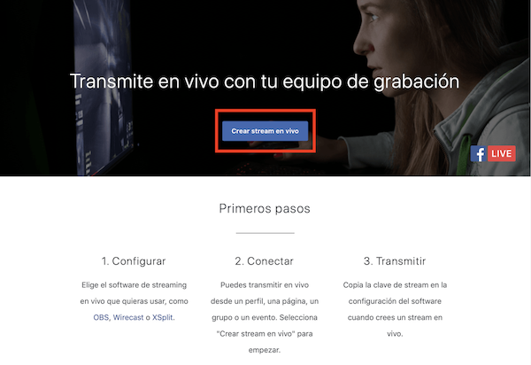
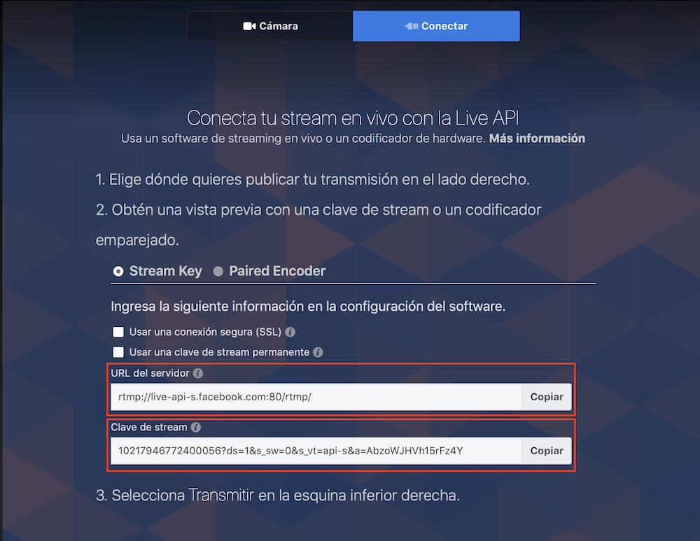
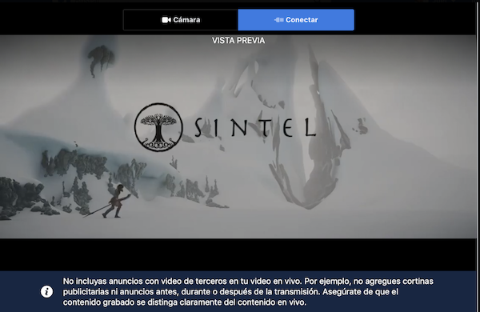

# VideoToFacebookLive
Un modulo simple para transmitir un video hacia `facebook live`.


## Crear un video en facebook live de forma manual

Dirigirse a la herramienta de creacion de videos en vivo https://www.facebook.com/live/create



En la pagina resultante podremos obtener una url de servidor y un identificador de nuestro nuevo video en vivo.



## Importar el modulo

Para este caso usaremos node y ffmpeg para llevar adelante esta transmisioón.

Usaremos el modulo `child_process` para ejecutar ffmpeg en segundo plano.

```javascript
const child_process = require('child_process');
```

Llamaremos a ffmpeg con una serie de parametros basados en la especificacion de facebook para los videos en vivo.

```javascript
child_process.spawn('ffmpeg', [
    '-re',
    '-i', 'Sintel.mp4',
    '-f', 'flv',
    '-profile:v', 'baseline',
    '-pix_fmt', 'yuv420p',
    '-acodec', 'libmp3lame',
    '-ar', '44100',
    '-b:a', '128k',
    '-vcodec', 'libx264',
    '-bufsize', '6000k',
    '-vb', '400k', 
    '-maxrate', '1500k',
    '-preset', 'veryfast',
    '-s', '426x240',
    '-r', '30',
    '-g', '30',
    process.env.BASE_URL + process.env.STREAM_KEY
]);
```

> En el ejemplo se usan variables de entorno para almacenar la url del servidor y la clave del stream

### Formato de video:

- Se aceptan videos con una resolución máxima de 720 píxeles (1.280 × 720) a 30 fotogramas por segundo, con un fotograma clave cada dos segundos.
- Se debe enviar al menos un frame (fotograma clave) cada dos segundos durante la transmisión.
- La tasa de bits máxima recomendada es de 4 Mbps. Aunque es posible traspasar este límite, eso haría que las transmisiones en vivo fueran muy inestables.
- Si se cambia la resolución en mitad de la transmisión, esta última se puede perjudicar.
- Los títulos deben tener menos de 255 caracteres. De lo contrario, se producirá un error en la transmisión.
- La Live API solo admite video codificado H264 y audio codificado AAC.

### Duración del video:

- Duración máxima de cuatro horas para las transmisiones en vivo.
- Duración máxima de cuatro horas para las transmisiones de vista previa (tanto en el cuadro de diálogo de transmisión en vivo como en las herramientas de editor). Después de 240 minutos, se deberá generar una nueva clave de transmisión.
- Las URL de transmisión RTMP caducarán 24 horas después de su creación.

### Configuración de audio avanzada:

- Frecuencia de muestreo de audio: 48 kHz
- Velocidad de bits de audio: 128 Kbps mono
- Códec de audio: AAC

### Configuración de video avanzada:

- Relación de aspecto del píxel: cuadrado
- Tipos de fotogramas: escaneo progresivo
- Velocidad de bits de codificación: CBR
- Códec de video: H264

Para probar que todo funcione correctamente ejcutemos el archivo `script.js` de forma local y podremos ver una vista previa en la pantalla de creacion de video vivo.

```javascript
node script.js
```


